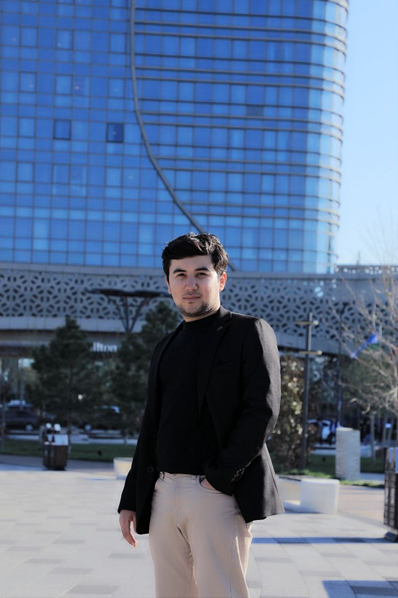

<!DOCTYPE html>
<html lang="en">
<head>
  <meta charset="UTF-8">
  <meta name="viewport" content="width=device-width, initial-scale=1.0">
  <title>Mukhammadali Akramov - CV</title>
  
</head>
<body>

  

  <h1>Mukhammadali Akramov</h1>

  <h2>Personal Information</h2>
  
📍 Wuppertal, 42105, Germany

  
📧 <a href="mailto:cfa.akramov@gmail.com">cfa.akramov@gmail.com</a>

  
📱 +49 1573 423 6532

  
📅 Date of Birth: 10 August 2002

  
🌐 <a href="https://linkedin.com/in/mukhammadali-akramov-7571a922a" target="_blank">LinkedIn Profile</a>

  <h2>Professional Experience</h2>
  <ul>
    <li>Trainee – Financial Consulting, Deutsche Vermögensberatung (DVAG), Germany (Feb 2025 – Present)</li>
    <li>Financial Analyst Intern, Uzbekistan Direct Investment Fund, Tashkent (April – Sept 2022)</li>
  </ul>

  <h2>Skills</h2>
  <ul>
    <li>Microsoft Office, Salesforce, Exact Target, Microsoft Excel, Performance reporting</li>
    <li>Financial Statement Analysis, Financial Modeling</li>
    <li>Google Ads Certifications (Measurement & Search)</li>
  </ul>

  <h2>Education</h2>
  <ul>
    <li>M.Sc. in International Management & Information Systems, Südwestfalen University (Expected 2027)</li>
    <li>B.A. in International Business, CBS International Business School (2024)</li>
    <li>B.Sc. in Accounting & Finance, Central Asian University (2023)</li>
    <li>Natural Sciences Program, Namangan State University Lyceum (2019)</li>
  </ul>

  <h2>Achievements</h2>
  <ul>
    <li>2nd Place & Finalist in Harvard Business Case Competition (2022 & 2023)</li>
    <li>Merit-based Scholarships</li>
    <li>CLDP Training in Fund Management & Securities Markets</li>
  </ul>

  <h2>Languages</h2>
  <ul>
    <li>English: Fluent | German: Advanced | Russian: Fluent | Turkish: Intermediate | Uzbek: Native</li>
  </ul>

  <h2>Hobbies</h2>
  <ul>
    <li>Reading, Fitness, Chess, Tennis</li>
  </ul>

  
<em>Date: 17 April 2025</em>

</body>
</html>
